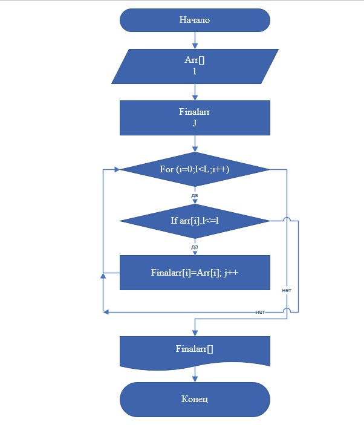

____
# Блок-схема

____
____

# Итоговая проверочная работа
____

  Для решения данной задачи использовался метод с введением элементов масива через терминал.

## Начало
Console.WriteLine("Введите размер массива");

## Вводим переменную значения длинны массива

int l = Convert.ToInt32(Console.ReadLine());

## Обозначаем масив

string[] arr = new string[l];
 
## Обозначаем вторую переменную для сохранения счета второго массива

int j=0;

## Создаем конечный массив

string[] finalarr= new string[l]; 

## Заполняем массив

for (int i = 0; i < l; i++) 
{
    Console.WriteLine("Веведите элемент массива");
             arr[i]= Console.ReadLine();
}

## Выводим првый массив 
Console.WriteLine( "Массив arr" );
for (int i = 0; i < l; i++) 
{
    Console.Write(arr [i] + " " );         
}
    Console.WriteLine(  );
## Решение задачи
for (int i = 0; i < l; i++ )
{
  if (arr [i].Length<=3)
{
## фИНАЛЬНЫЙ МАССИЫВ!!!!!
    finalarr [j]=arr [i]; 
    j++;
}
}
## Выводим финальный масив

Console.WriteLine( "finalarr" );
for (int i = 0; i < l; i++) 
{
    Console.Write(finalarr [i] + " " );         
}
    Console.WriteLine( );